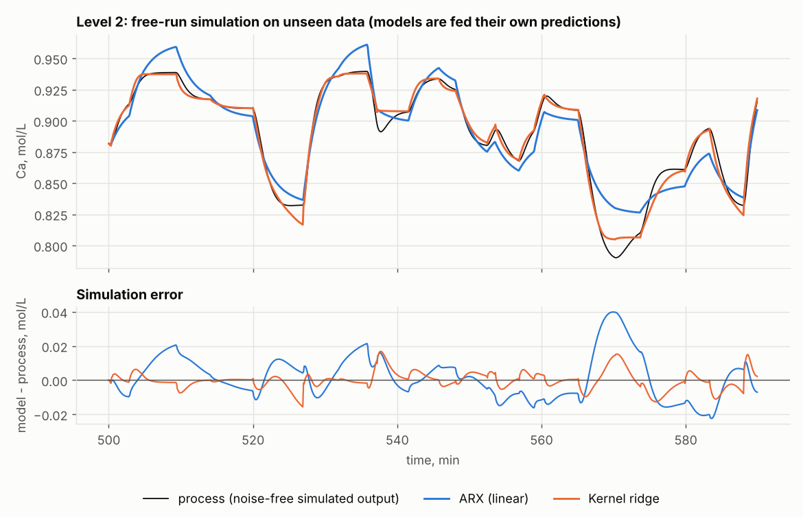
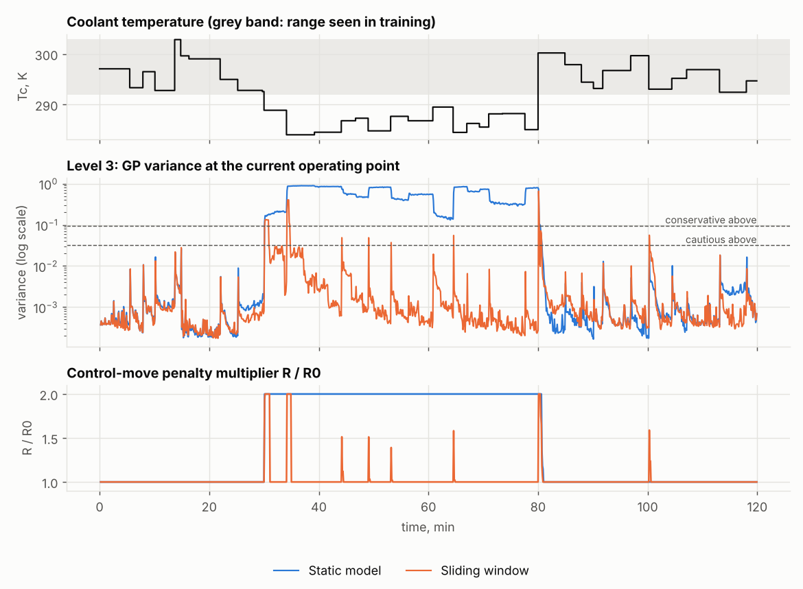

# Adaptive kernel model of a nonlinear reactor (CSTR) in Python

A complete example of process identification with a three-level kernel architecture:
from a raw plant-style log to a validated nonlinear model that rejects bad measurements,
follows slow drift and knows where it can be trusted.

**Process.** Continuous stirred-tank reactor with an exothermic reaction A -> B, a standard
textbook benchmark (Henson & Seborg, *Nonlinear Process Control*, 1997). Input: coolant
temperature. Output: concentration of A. The process gain changes several-fold across the
operating range, so a single linear model cannot describe it.

**Architecture.** Three kernel methods share one RBF kernel, each with its own job:

| Level | Method | Job |
|---|---|---|
| 1 | Support vector regression (SVR) | rejects anomalous measurements before they reach the model |
| 2 | Kernel ridge regression (KRR) on a sliding window | the process model; refitted as new data arrive |
| 3 | Gaussian process (GP) variance | detects operation outside the training data and raises the penalty on control moves |

KRR is written out in NumPy (`kernel.py`). One matrix factorisation gives the model, the
exact leave-one-out error for tuning, the analytical gradient and the GP variance.

**What the script does**

1. Simulates an identification experiment with noise, spikes and a logger gap.
2. Start-up on historical data: cleans it with the filter and tunes the kernel by exact leave-one-out.
3. Tests the filter and the model on unseen data; compares with a linear ARX model in free-run simulation.
4. Runs a slow-drift scenario (catalyst deactivation) with and without each level.
5. Runs an excursion outside the training range and shows the supervisor's reaction.
6. Checks the closed-form results numerically and writes `outputs/report.md`.

**Run**

    pip install -r requirements.txt
    python run_demo.py                  # about 3 minutes
    python run_demo.py --data log.csv   # your own log (t_min, Tc_K, Ca_mol_L): steps 2-3 and 6

**Files**

| File | Purpose |
|---|---|
| `cstr.py` | reactor equations and simulator |
| `data.py` | simulated plant logs, noise estimate, reference detector |
| `kernel.py` | RBF kernel, KRR, exact leave-one-out, gradient, GP variance |
| `adaptive.py` | SVR filter, sliding window, GP supervisor, online loop |
| `pipeline.py` | start-up, tuning, reference models, scoring |
| `checks.py` | numerical self-checks |
| `figures.py`, `report.py` | figures and report template |
| `run_demo.py` | the scenarios |

**Results of the reference run** (`outputs/report.md`, all errors in mol/L, sensor noise 0.002)

| Test | Result |
|---|---|
| Free-run simulation on unseen data, kernel model vs linear ARX | RMSE 0.0057 vs 0.0111 |
| Anomaly filter on unseen data | precision 0.85, recall 1.00 |
| One-step error with and without the filter | 0.0021 vs 0.0036 |
| Slow drift: static model / window only / full system | 0.0041 / 0.0034 / 0.0017 |
| GP variance inside vs outside the training range (static model) | 0.0006 vs 0.56 |

**Scope.** Simulation study on a textbook process; not plant data. No controller yet:
the supervisor's penalty multiplier is computed for a model-predictive controller that
is the next part of this project.

**Background.** The three-level architecture (SVR filter, sliding-window KRR, GP supervisor
on one shared kernel) comes from my PhD thesis, where it was developed for iron-ore magnetic
separation. This repository is a new implementation on an open textbook process; it contains
no code or data from the thesis. Changes made for a dynamic process are listed in the report.

- O. Volovetskyi. *Predictive Control of a Nonlinear Magnetic Separation Process Based on
  Kernel Functions.* PhD thesis, Kryvyi Rih National University, 2026.
- O. Volovetskyi. Local Linearization of Kernel Models in Real Time as a Basis for Fast
  Optimization in MPC. *Automation of Technological and Business Processes*, 17(4), 98-103,
  2025. DOI: 10.15673/atbp.v17i4.3319
- O. Volovetskyi. Utilizing Gaussian Process Regression for Nonlinear Magnetic Separation
  Process Identification. *IAPGOS*, 14(3), 21-28, 2024. DOI: 10.35784/iapgos.5954
- O. Volovetskyi. Methods of Filtering and Regression for Forecasting Noisy Timeseries Based
  on Machine Learning. *Herald of Advanced Information Technology*, 8(1), 13-27, 2025.
  DOI: 10.15276/hait.08.2025.1

**License.** MIT.
