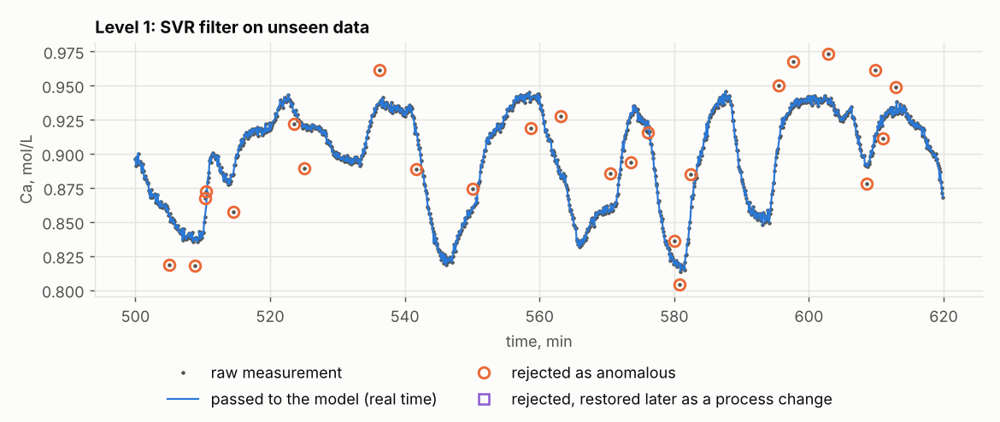
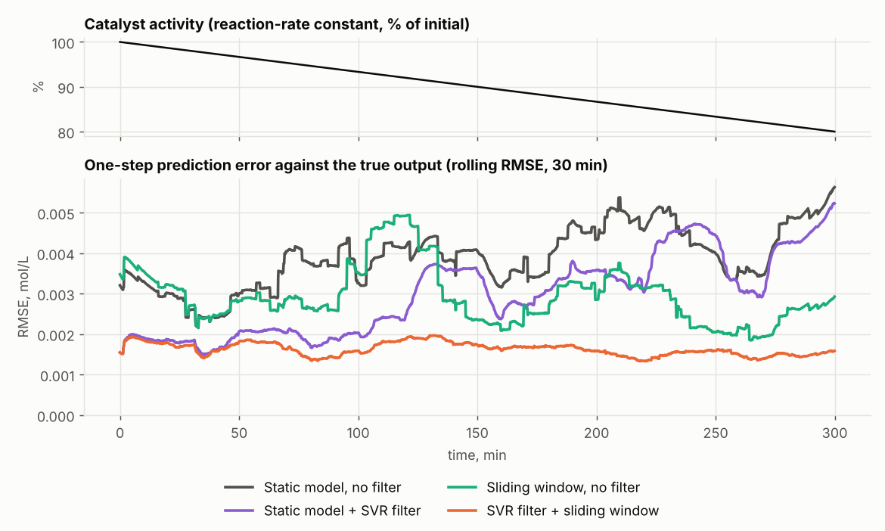
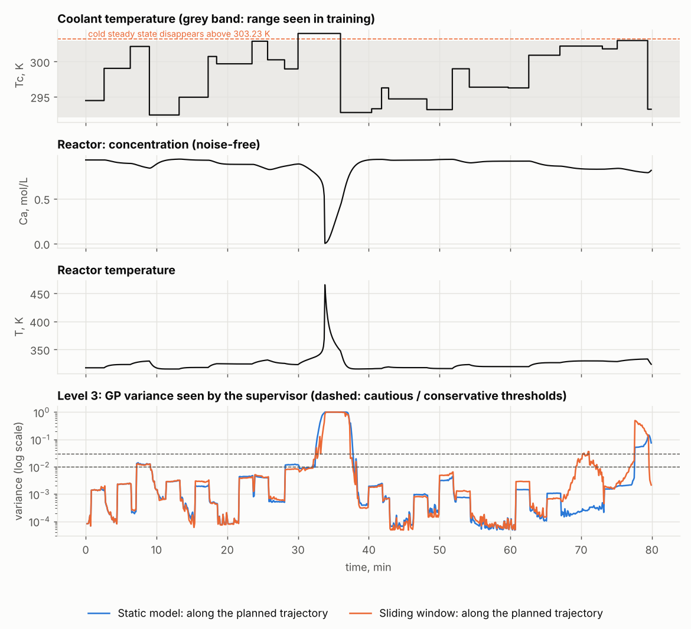

# Adaptive kernel model of a CSTR: validation report

Process: continuous stirred-tank reactor, exothermic reaction A -> B. Input: coolant temperature Tc. Output: concentration Ca. All errors are in mol/L.
Data: simulated experiments on the textbook model (Henson & Seborg, 1997) with sensor noise, isolated spikes in 2 % of the samples and a logger gap added on purpose.
Sections 1-7 are one realisation (seed 0); section 8 repeats the experiments over many seeds.

The identification system has three levels that share one RBF kernel:

1. an SVR filter rejects anomalous measurements;
2. kernel ridge regression (KRR) on a sliding window of 1000 samples is the process model;
3. a Gaussian-process (GP) supervisor measures how far the trajectory planned from the current operating point is from the training data.

## 1. Data

- Samples: 8000, sampling period 0.1 min; missing values: 8.
- Estimated sensor noise: 0.00197 (standard deviation; second differences, robust scale with outlier trimming).
- Input range: 292.1 to 303.0 K, 232 distinct levels; the least-visited tenth of the range holds 7.3 % of samples.
- Start-up (cleaning, tuning, threshold calibration, first model): first 5000 samples. Test: last 3000 samples, never used for fitting, tuning or calibration.

## 2. Level 1: anomaly filter

A measurement is rejected when it differs from the SVR one-step prediction by more than a threshold; the rejected value is replaced by the model prediction in the history. The threshold is calibrated on start-up data so that a chosen share of normal samples is rejected: the filter is replayed as online (an SVR on the last 1000 rows, refitted every 20 rows, predicts the rows that follow), and the threshold is the corresponding quantile of these out-of-sample residuals, divided by the in-sample robust scale of the SVR that produced them (3744 rows). The residuals have heavier tails than a normal distribution, so the threshold is not a number of Gaussian standard deviations.
A run of 4 rejections in a row is taken as a process change, and the rejected samples of the run are put back into the history afterwards. Two counts therefore exist: decisions as taken at each sample (real time, what a controller receives) and the final flags after these restores. The real-time count is the primary one.
Default share: 0.5 %; threshold 3.74 times the in-sample robust scale. On the test data the filter rejected 64 samples in real time; 3 of them were restored later as parts of process changes, leaving 61.

Precision / recall against the known injected spikes, test data. Every row is the full adaptive system. The rolling medians (window 7) have no restores, so they compare with the real-time column; they are calibrated to the same share on the same start-up data.

| Target share of normal samples rejected | SVR filter, real time | SVR filter, after restores | Rolling median, causal | Rolling median, centred (non-causal: needs 3 future samples) |
|---|---|---|---|---|
| 1.0 % | 0.71 / 1.00 (53 of 53 caught, 75 flagged; 0.75 % of normal samples rejected) | 0.74 / 1.00 (53 of 53 caught, 72 flagged; 0.64 % of normal samples rejected) | 0.63 / 0.77 (41 of 53 caught, 65 flagged; 0.81 % of normal samples rejected) | 0.65 / 1.00 (53 of 53 caught, 81 flagged; 0.95 % of normal samples rejected) |
| 0.5 % | 0.83 / 1.00 (53 of 53 caught, 64 flagged; 0.37 % of normal samples rejected) | 0.87 / 1.00 (53 of 53 caught, 61 flagged; 0.27 % of normal samples rejected) | 0.83 / 0.72 (38 of 53 caught, 46 flagged; 0.27 % of normal samples rejected) | 0.79 / 1.00 (53 of 53 caught, 67 flagged; 0.48 % of normal samples rejected) |
| 0.2 % | 1.00 / 0.72 (38 of 53 caught, 38 flagged; 0.00 % of normal samples rejected) | 1.00 / 0.72 (38 of 53 caught, 38 flagged; 0.00 % of normal samples rejected) | 0.92 / 0.66 (35 of 53 caught, 38 flagged; 0.10 % of normal samples rejected) | 0.95 / 1.00 (53 of 53 caught, 56 flagged; 0.10 % of normal samples rejected) |

At the default share the SVR filter has precision 0.83 and recall 1.00 in real time; the causal rolling median, the detector usable online without delay, has 0.83 and 0.72. The centred median sees 3 future samples and could only run with a 0.3-min delay.
In real time the filter rejected 0.37 % of normal samples against the calibration target of 0.5 % (0.27 % after restores). The difference between the two counts consists of normal samples rejected in runs that were later recognised as process changes; the calibration tests single samples and does not include them.
With the filter the one-step error of the window model is 0.0017; without it, 0.0031 (1.8 times larger).

## 3. Level 2: process model

KRR and two linear references predict the next sample of Ca from the last two samples of Ca and Tc: ARX (least squares on the one-step error) and OE (least squares on the free-run error).
Kernel width 3.16 and regularisation 0.0100 (normalised units) were chosen in two stages. (1) Exact leave-one-out (LOO) RMSE over a grid, on a random subset of the first 80 % of the start-up rows: 25 settings lie within 2 % of the best. LOO measures the one-step error, and these candidates differ in free run: on the held-out last 20 % of the start-up block (1000 samples) their free-run RMSE ranges from 0.0052 to 0.0065. (2) Settings within 50 % of the best held-out free run are admissible (25); among them the strongest regularisation and then the narrowest kernel are taken: the smoothest model whose uncertainty still grows quickly away from the data. The chosen setting: LOO 1.0167 times the minimum, held-out free-run RMSE 0.0060; the LOO-minimum setting (width 7.94, regularisation 1.0e-04) gives 0.0056.
Errors are measured against the noise-free simulated output. Free-run: the model is fed its own predictions, as inside a controller.

| Model | One-step RMSE | Free-run RMSE | Free-run max error | Free-run fit |
|---|---|---|---|---|
| ARX (linear, equation error) | 0.0018 | 0.0121 | 0.0566 | 64.3 % |
| OE (linear, output error) | 0.0038 | 0.0100 | 0.0532 | 70.6 % |
| Kernel ridge | 0.0016 | 0.0063 | 0.0356 | 81.5 % |

The kernel model's free-run error is 1.9 times smaller than ARX's and 1.6 times smaller than OE's.
KRR, like ARX, is fitted on the one-step (equation) error with noisy lagged outputs in the regressor; OE is fitted on the free-run error, which removes the bias that this noise causes in the linear coefficients. KRR against ARX therefore compares nonlinear with linear under the same criterion; KRR against OE compares it with the best linear simulation model, which has the advantage of the criterion.
The error is not uniform: where Ca is in its lowest tenth (below 0.845, the hot end, where the reactor gain is steepest) the kernel model's free-run RMSE is 0.0147; elsewhere it is 0.0045.

## 4. Operating range and stability of the reactor

Steady states of the simulated reactor on the cold (low-temperature) branch, computed from the model equations:

| Tc, K | Ca, mol/L | Gain dCa/dTc, mol/(L K) | Slowest time constant, min | Steady states |
|---|---|---|---|---|
| 292.0 | 0.9435 | -0.0047 | 0.89 | 1 |
| 297.0 | 0.9116 | -0.0087 | 0.77 | 1 |
| 300.0 | 0.8773 | -0.0154 | 0.95 | 3 |
| 302.0 | 0.8348 | -0.0310 | 1.34 | 3 |
| 303.0 | 0.7871 | -0.0879 | 2.38 | 3 |

Across the identified range the gain grows 19-fold and the dynamics at the upper edge are 3.1 times slower than at their fastest. In the upper part of the range three steady states coexist. The cold steady state disappears at Tc = 303.23 K (saddle-node point: the first maximum of Tc along the steady-state curve, where f = 0 and df/dT = 0 for the energy balance f), 0.23 K above the upper edge of the identified range. At 304.0 K the steady states are: Ca 0.145, T 376.7 K, largest real part of the eigenvalues 0.524 1/min — none of them stable, so the reactor ignites and cannot settle (section 7).

The saddle-node point under changes of the process parameters:

| Parameters | Tc at the limit, K | Ca at the limit, mol/L | T at the limit, K | Ca >= 0.79 excludes the limit |
|---|---|---|---|---|
| nominal | 303.23 | 0.7443 | 335.7 | yes |
| UA -5 % (fouling) | 301.55 | 0.7594 | 334.6 | yes |
| UA -10 % | 299.74 | 0.7733 | 333.6 | yes |
| Tf +1 K | 302.75 | 0.7443 | 335.7 | yes |
| k0 x0.8 (end of the drift scenario) | 307.52 | 0.7361 | 339.1 | yes |
| Caf +5 % | 302.00 | 0.8034 | 334.2 | no |
| Caf -5 % | 304.57 | 0.6823 | 337.4 | yes |
| q +10 % | 301.94 | 0.7681 | 335.2 | yes |
| q -10 % | 304.63 | 0.7106 | 336.5 | yes |
| UA -5 % and Caf +5 % | 300.33 | 0.8171 | 333.3 | no |

Neither candidate constraint follows the limit reliably:
- a fixed bound on Tc: the limit moves inside the identified range in 6 of 10 cases (UA -5 % (fouling), UA -10 %, Tf +1 K, Caf +5 %, q +10 %, UA -5 % and Caf +5 %);
- a lower bound Ca >= 0.79 mol/L (the steady-state Ca at the edge of the data rounded up): Ca at the limit grows with the feed concentration Caf. A rise of Caf by 3.85 % brings Ca at the limit to 0.79 (by 1.46 % with 10 % less heat transfer); beyond that the bound admits inputs at which the cold steady state no longer exists (cases: Caf +5 %, UA -5 % and Caf +5 %).
- T at the limit stays between 333.3 and 339.1 K in all cases; if the reactor temperature is measured, it is a candidate for a constraint (not tested here).

Ca is also a late indicator. Open-loop test: from the cold steady state 0.5 K below the limit the input steps to 303.0 K (inside the allowed range); a given time after the true Ca falls to 0.79, the input drops at once to 292.0 K, the strongest cooling in the range. Peak reactor temperature, K:

| Case | Start Tc, K (Ca) | Ca reaches the bound after, min | delay 0 min | delay 0.3 min | delay 0.5 min | delay 1 min |
|---|---|---|---|---|---|---|
| UA -10 % | 299.24 (0.826) | 0.88 | 336.8 | 341.4 | 470.6 | 481.9 |
| Caf +5 % | 301.50 (0.862) | 2.05 | 338.6 | 341.7 | 345.6 | 480.8 |

A delay of a few samples between Ca crossing the bound and full cooling decides whether the reactor ignites. The constraints for the controller are therefore an open design question of the next part. Requirements that follow from this report:
- an input bound with a margin to the limit for the worst admissible set of process parameters, which has to be stated (the table above);
- protective constraints fed with the raw measurement: the filter can replace up to 3 samples of a fast fall by predictions before it recognises a process change (section 7);
- the supervisor's penalty increase must not slow down protective moves: on the hot side it rises while Ca is already falling (section 7);
- a closed-loop test on the cases of the table.

## 5. Slow drift of the process

Catalyst activity falls linearly to 80 % over 3000 samples. The steady-state Ca at the end is higher by 0.014 at 292 K, 0.026 at 297 K, 0.103 at 303 K.

One-step RMSE against the true output, by quarter of the run:

| Strategy | Q1 | Q2 | Q3 | Q4 | Whole run |
|---|---|---|---|---|---|
| Static model, no filter | 0.0029 | 0.0040 | 0.0044 | 0.0043 | 0.0040 |
| Static model + SVR filter | 0.0019 | 0.0028 | 0.0031 | 0.0042 | 0.0031 |
| Sliding window, no filter | 0.0029 | 0.0037 | 0.0031 | 0.0023 | 0.0030 |
| SVR filter + sliding window | 0.0017 | 0.0017 | 0.0016 | 0.0015 | 0.0016 |

The one-step error is dominated by the measurement history and hardly grows with the drift. Without adaptation the model is the same with or without the filter, so the two static rows of the next table coincide. The test that matters for a controller is the free run: each quarter is simulated by the model frozen at the start of that quarter. RMSE / largest error:

| Strategy | Q1 | Q2 | Q3 | Q4 |
|---|---|---|---|---|
| Static model, no filter | 0.0131 / 0.0424 | 0.0211 / 0.0458 | 0.0262 / 0.0573 | 0.0286 / 0.0604 |
| Static model + SVR filter | 0.0131 / 0.0424 | 0.0211 / 0.0458 | 0.0262 / 0.0573 | 0.0286 / 0.0604 |
| Sliding window, no filter | 0.0131 / 0.0424 | 0.0153 / 0.0332 | 0.0088 / 0.0292 | 0.0086 / 0.0183 |
| SVR filter + sliding window | 0.0131 / 0.0424 | 0.0154 / 0.0378 | 0.0105 / 0.0202 | 0.0083 / 0.0204 |

Contributions, separated:
- filter (both models static), one-step RMSE: 0.0040 without, 0.0031 with;
- adaptation (both with the filter), free-run RMSE in Q4: 0.0286 static, 0.0083 with the sliding window (3.5 times);
- a frozen filter on a drifting process rejects valid data (real time): static filter 0.54 / 0.98 (54 of 55 caught, 100 flagged; 1.56 % of normal samples rejected); filter refitted with the window 0.95 / 0.95 (52 of 55 caught, 55 flagged; 0.10 % of normal samples rejected).

## 6. Level 3: leaving the training range (cold side)

The coolant temperature moves to 284-290 K, never seen during start-up, and returns. The supervisor receives the largest GP variance along the free-run of the model over 20 samples (2 min) under the planned input; in this open-loop test the plan is the input schedule itself, in a predictive controller it is the candidate input sequence. The trajectory starts at the current regressor, so an input change is first seen 18 samples before it: that is the largest possible warning. The supervisor is cautious above 0.0100 and conservative above 0.0300; the penalty on control moves rises continuously up to twofold. The thresholds are a heuristic: th1 equals the selected regularisation lam (the noise variance of the equivalent GP, normalised units) and th2 = 3 th1, so they move with lam; here lam is 2.4 times the estimated sensor-noise variance in the same units, so the thresholds are not tied to the measured noise. The GP prior variance is fixed at 1, so the variance measures data coverage, not a calibrated error.

| | Static model | Sliding window |
|---|---|---|
| GP variance inside the range, current point (median) | 0.00011 | 0.00017 |
| GP variance outside, current point (median) | 0.09512 | 0.00026 |
| GP variance outside, along the planned trajectory (median) | 0.19210 | 0.00120 |
| GP variance outside with the input set to 292.0 K (median) | 0.01012 | 0.00185 |
| GP variance outside with the input set to 297.5 K (median) | 0.01151 | 0.01539 |
| GP variance outside with the input set to 303.0 K (median) | 0.02942 | 0.07250 |
| Time outside not normal: current point only | 100 % | 9 % |
| Time outside not normal: planned trajectory (supervisor) | 100 % | 23 % |
| Time inside not normal (supervisor) | 7.2 % | 31.7 % |
| Warning before the input leaves the range, samples: current point / trajectory | 0 / 18 | 0 / 18 |
| Warning before the input returns, samples: current point / trajectory | already warning / already warning | 0 / 18 |
| Samples from leaving the range to the first normal sample (supervisor) | never | 7 |
| One-step RMSE inside | 0.0029 | 0.0043 |
| One-step RMSE outside | 0.0224 | 0.0023 |
| Filter outside, real time: precision / recall | 0.82 / 1.00 | 0.67 / 1.00 |
| Samples outside in filter jump mode | 493 | 9 |

A frozen model stays uncertain for as long as the process is outside the range. The sliding window learns the neighbourhood of the current operating point within a few samples, so the variance at the current point alone soon reads normal. Normal then means only that the planned trajectory runs through data the window has seen; the probed variances show the model's coverage of other inputs. Because the supervisor checks the planned trajectory, it can warn before the input leaves the range and before it returns, by at most 18 samples.
With the window frozen (static model) the filter cannot agree with the new data, so it stays in jump mode, where single spikes are caught by the model-free trend test.

## 7. Hot side: beyond the stability limit

The coolant temperature is held at 304.0 K, 1 K above the identified range and beyond the saddle-node point, for 60 samples (6 min, from sample 300), then returns.
- The reactor ignites: the true Ca falls below 0.79 at sample 323; it leaves the start-up range (below 0.784) at sample 324, 24 samples after the step. Ca falls to 0.002 and the reactor temperature rises from 322.8 to 465.2 K. After the return it settles back on the cold branch (Ca 0.815, T 323.4 K).
- The planned trajectory first contains 304 K at sample 282. From there to the step, the largest variance along it is 0.0123 (static) and 0.0085 (window), against the cautious threshold 0.0100. The variance measures the distance from the data, not the closeness of the stability limit, and 1 K beyond the data that distance is small.

| | Static model | Sliding window |
|---|---|---|
| Normal just before the first opportunity | yes | yes |
| First warning (not normal), sample | 282 | 322 |
| First conservative regime (penalty x2), sample | 325 | 325 |
| Measurements replaced in real time during the step (by the model prediction, in jump mode by the trend extrapolation) and restored later | 321, 322, 323, 334, 335, 336, 338, 339, 340, 344, 345, 346 | 318, 319, 320, 334, 335, 336, 338, 339, 340, 344, 345, 346 |
| Largest overstatement of Ca by those replacements (value passed on - measurement), mol/L | 0.5010 | 0.5010 |

A warning only raises the move penalty; it does not stop the input. While Ca is falling, the filter may replace up to 3 measurements in a row by a prediction (of the model, or of the trend in jump mode) before the run is recognised as a process change, and the conservative regime doubles the move penalty. Both act against a protective move, so the supervisor is not a substitute for hard constraints (section 4); section 8 shows how often it warns in time.

## 8. Spread over 20 seeds

All simulated experiments repeated with seeds 0-19 (new input sequences, noise, spikes and start-up for each seed; every experiment of every seed has its own random stream). Median [25th; 75th percentile]:

| Quantity | Median [IQR] |
|---|---|
| Estimated / true sensor noise | 0.998 [0.985; 1.008] |
| Free-run RMSE, kernel model | 0.0060 [0.0052; 0.0064] |
| Free-run RMSE, ARX | 0.0112 [0.0106; 0.0122] |
| Free-run RMSE, OE | 0.0092 [0.0084; 0.0103] |
| Free-run RMSE ratio ARX / kernel | 1.92 [1.60; 2.17] |
| Free-run RMSE ratio OE / kernel | 1.60 [1.31; 1.75] |
| Tuning: held-out free-run RMSE of the chosen setting | 0.0062 [0.0052; 0.0072] |
| Tuning: held-out free-run RMSE of the LOO-minimum setting | 0.0058 [0.0050; 0.0082] |
| Tuning: worst held-out free-run RMSE among LOO candidates | 0.0104 [0.0065; 0.0370] |
| Tuning: held-out free run, chosen / best candidate | 1.12 [1.03; 1.33] |
| Selected lam / sensor-noise variance (normalised units) | 6.6 [2.5; 8.5] |
| SVR filter precision, real time (default share) | 0.82 [0.71; 0.87] |
| SVR filter recall, real time (default share) | 0.98 [0.97; 1.00] |
| SVR filter: normal samples rejected, real time | 0.4 % [0.3; 0.8] |
| SVR filter: normal samples rejected, after restores | 0.2 % [0.1; 0.3] |
| Causal median precision (same share) | 0.81 [0.72; 0.88] |
| Causal median recall (same share) | 0.77 [0.75; 0.80] |
| One-step RMSE ratio without / with filter | 1.66 [1.48; 1.81] |
| Drift, one-step: static no filter / full system | 2.35 [2.16; 2.41] |
| Drift, one-step: static no filter / static + filter | 1.24 [1.07; 1.31] |
| Drift, free-run Q4: static + filter / full system | 3.49 [3.26; 3.85] |
| Cold excursion, window: time outside not normal | 15.2 % [12.4; 20.3] |
| Cold excursion, window: time inside the range not normal | 11.5 % [8.3; 16.1] |
| Cold excursion, window: warning before return, samples | 18 [18; 18] |
| Cold excursion, window: samples to normal after leaving | 16 [10; 24] |
| Cold excursion, static: time outside not normal | 100.0 % [99.5; 100.0] |
| Hot side: largest planned-trajectory variance before ignition / th1 | 1.26 [0.89; 2.19] |
| Hot side, window: first warning relative to Ca leaving the start-up range, samples (negative = before) | -39 [-43; 2] |
| Hot side, static: the same | -40 [-43; 0] |

Hot side: the supervisor warned at least 10 samples (1 min) before Ca left the start-up range in 11 of 20 seeds with the sliding window (11 of them at the first opportunity; 1 seed not counted because it was already not normal before); 12 of 20 seeds with the static model (11 of them at the first opportunity; 2 seeds not counted because it was already not normal before). Even when it warns, it only raises the move penalty.
Cold excursion, sliding window: the warning before the input returns came at the first opportunity (18 samples before) in 19 of 20 seeds.
Selected regularisation (it also sets the supervisor thresholds): 1.0e-05 in 1 seed, 1.0e-02 in 8 seeds, 3.2e-02 in 11 seeds.
Tuning: the free-run stage removed candidates in 12 of 20 seeds; the worst LOO candidate had 39 times the best held-out free-run RMSE. The chosen setting stays within 50 % of the best by construction (largest ratio 1.47).
The linear OE model was more accurate than the kernel model in 3 of 20 seeds.

## 9. Numerical self-checks

- Analytical gradient against central differences: largest relative deviation 2.9e-08 (normalised units), 4.2e-09 (physical units, as needed for MPC).
- Closed-form leave-one-out residuals against actual refits: largest deviation 7.3e-14; the eigen-decomposition shortcut used for tuning against them: relative deviation 1.9e-14.
- GP variance from the KRR factorisation against a library GP: largest deviation 2.0e-15.
- Leave-one-out search over 90 settings on 1000 samples: 2.4 s.
- Stability limit: at the computed saddle-node point |f| = 1.4e-14 and |df/dT| = 7.1e-11 K/min (central differences).
- These checks confirm that the code matches the formulas; they do not show that the GP variance is a calibrated error estimate.

## 10. Design choices for a dynamic process

- The model is dynamic (NARX with 2 past outputs and 2 past inputs), not a static input-output map.
- Anomaly threshold: calibrated to reject 0.5 % of normal samples on start-up data (out-of-sample residual quantile).
- Window of 1000 samples, refitted every 20 accepted samples; the SVR filter is refitted together with it.
- A run of 4 rejections is taken as a process change: the rejected samples are restored to the history and the window; until the filter agrees again, single spikes are caught by a model-free trend test and the models are refitted every 5 accepted samples.
- The supervisor checks the trajectory planned over 20 samples, not only the current point.
- Tuning: leave-one-out candidates within 2 % of the best, then admissible within 50 % of the best free run on the held-out 20 % of the start-up block; among those, the strongest regularisation and then the narrowest kernel.
- A rejected or missing sample is replaced by the model prediction in the regressor history.

## 11. Limits

- Validated for Tc between 292.1 and 303.0 K at a sampling period of 0.1 min.
- Simulation study on a textbook process; no plant data.
- The supervisor's penalty multiplier is computed but not yet used: there is no controller in this part.
- Anomalies are isolated spikes only; a sensor fault that lasts several samples is treated as a process change.
